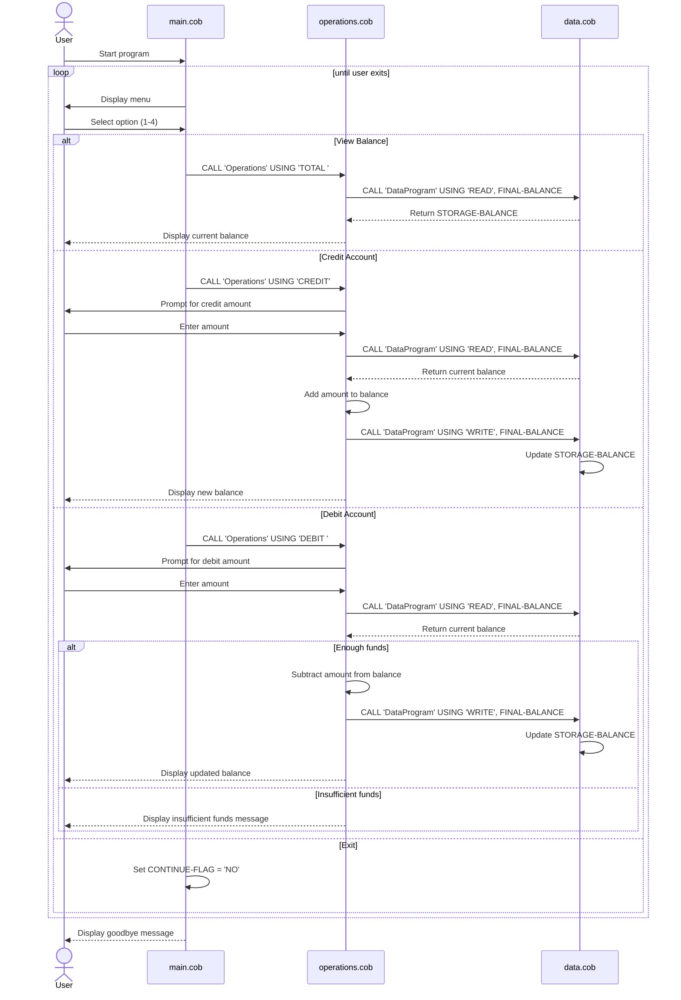

# COBOL Account Management Documentation

This project contains a small COBOL-based student account management system. It simulates a basic account ledger with a starting balance, balance inquiry, crediting funds, and debiting funds with validation.

## File overview

### src/cobol/main.cob
Purpose:
- Entry point for the application.
- Presents the user menu and routes requests to the account operations logic.

Key functions / logic:
- Displays the account menu:
  - View Balance
  - Credit Account
  - Debit Account
  - Exit
- Accepts a numeric choice from the user.
- Uses EVALUATE to dispatch to the appropriate operation.
- Loops until the user selects Exit.

Business behavior:
- The menu is intentionally simple and interactive.
- Invalid selections trigger a warning and redisplay the menu.
- Exit is controlled by the CONTINUE-FLAG value set to 'NO'.

### src/cobol/operations.cob
Purpose:
- Implements the business operations for account management.
- Performs reads and writes through the data program.

Key functions / logic:
- TOTAL : retrieves the current balance and displays it.
- CREDIT: prompts for an amount, reads the current balance, adds the amount, saves the new balance, and displays the result.
- DEBIT: prompts for an amount, checks available funds, subtracts only when sufficient, and saves the updated balance.

Business rules:
- The initial balance is 1000.00.
- Only positive numeric amounts are accepted from the user input field, as defined by the PIC 9(6)V99 format.
- A debit is allowed only if the current balance is greater than or equal to the amount requested.
- If funds are insufficient, the program prints: "Insufficient funds for this debit."
- After a successful credit or debit, the updated balance is written back to storage.

### src/cobol/data.cob
Purpose:
- Stores and retrieves the account balance.
- Acts as the data layer for the application.

Key functions / logic:
- Uses a WORKING-STORAGE balance initialized to 1000.00.
- Accepts a passed operation type through the LINKAGE SECTION.
- If the operation is READ, the current balance is returned to the caller.
- If the operation is WRITE, the new balance is stored in the application state.

Business rules:
- Only two operation codes are recognized:
  - READ
  - WRITE
- The storage balance is the authoritative value for the program's current account state.

## Student account business rules summary

Although the code does not explicitly mention a student-specific account type, the implemented rules are consistent with a basic student account or savings-style account:

- Accounts start with a default balance of 1000.00.
- Students can check the current balance.
- Students can add money to the account via crediting.
- Students can remove money via debiting, but cannot withdraw more than the available balance.
- Transactions are not tracked historically; the program only keeps the current balance in memory.
- No interest, fees, overdraft limits, or account status rules are implemented in this version.

## Transaction flow overview

1. The user starts in the main menu.
2. A menu option selects one operation: balance, credit, or debit.
3. The operation program calls DataProgram to read the current balance.
4. The balance is updated in memory.
5. The updated value is written back to storage using the WRITE operation.
6. The result is displayed to the user.

## Notes

This implementation is a compact demonstration of COBOL procedural logic, not a full banking system. It demonstrates simple modular programming with separate data, menu, and operations programs.

